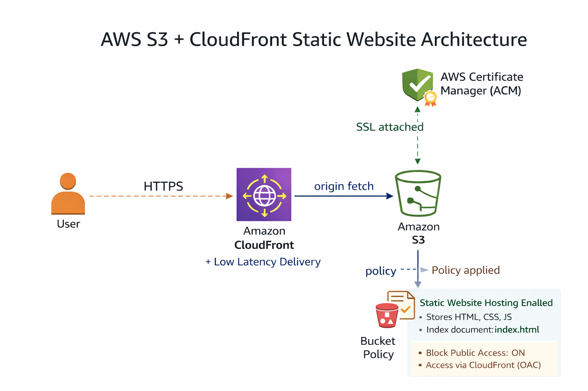

<h1 align="center">🌐 Project 2 — Static Website Hosting using Amazon S3 & CloudFront</h1>
<p align="center"><b>Serverless | CDN Accelerated | HTTPS Enabled | Free-Tier Eligible</b></p>


---

## 🎯 Objective
Deploy a **static website** using **Amazon S3** and deliver it globally with **CloudFront CDN** and **HTTPS**, without using EC2 or backend servers — ensuring **high availability** and **zero maintenance cost**.

---

## 🧩 Problem Statement
| Requirement | Implementation |
|------------|----------------|
| Host front-end website files | Use Amazon S3 Static Website Hosting |
| Public internet access | Add S3 Bucket Policy (Public Read) |
| Improved global performance | Integrate Amazon CloudFront CDN |
| Secure HTTPS access | Enable SSL using AWS Certificate Manager (Automatically via CloudFront) |
| Cost efficient | Free-tier serverless architecture (No EC2 required) |

---

## 🏗️ Architecture Diagram

 
 

## ☁️ AWS Services Used


| Service | Purpose | Why Used |
|--------|---------|----------|
| **Amazon S3** | Stores and hosts static website files | Enables serverless static web hosting under free tier |
| **Amazon CloudFront** | Global CDN caching & fast content delivery | Makes website faster for users worldwide |
| **AWS Certificate Manager (ACM)** | Issues SSL Certificates | Enables **HTTPS** for secure & trusted website access |
| **IAM (Identity & Access Management)** | Controls permissions for resources | Ensures only authorized access to bucket contents |
| **S3 Bucket Policy** | Public read access policy | Allows end users to view hosted website files via browser |


## 📂 Project Directory Layout
```

aws-project2-s3-cloudfront-deployment
│
├── site
│ ├── index.html
│ └── style.css
│
├── docs
│ ├── project2_problem_statement.pdf
│ ├── project2_overview.pdf
│ └── project2_final_report_v8.pdf
│
└── README.md
```


## 📄 Project Documentation
--------------------------
📘 **Detailed Project Documentation (PDF & Reports)**  
👉 [View Documentation](aws-project2-s3-cloudfront-deployment/docs/DOCUMENTATION.pdf)


## 🌍 Live Website URL:
  https://d345486x3djd94.cloudfront.net
Website loads globally with HTTPS and CDN caching enabled ✅


## 🎥 Project Demo Video
--------------------------
 
Click To Watch👉 [Watch Demo](https://drive.google.com/file/d/1-IxHhJpkYO3g4SYbmF_WneD4RCHDNWsm/view?usp=drive_link)


## 💡 Key Learnings
----------------------------
S3 works as a web hosting service for static content.
CloudFront improves global speed using edge caching.
ACM enables HTTPS at zero cost.
Avoiding EC2 means no compute cost and no server maintenance.


## 💼 Resume Bullet Points:
Deployed a static web application using Amazon S3 and CloudFront, enabling secure, globally distributed access under AWS Free Tier.
Configured S3 bucket policies, static website hosting, and CloudFront CDN for caching and HTTPS enforcement.
Achieved cost-effective and serverless deployment by eliminating EC2 compute requirements.


## 🗣️ Viva / Interview Response
------------------------------------
“I hosted the website on S3 because it contains only static files and doesn't need a server.
CloudFront provides global caching and enables HTTPS for secure delivery.
This architecture is scalable, cost-efficient, and commonly used in industry deployments.”


---
<h2 align="center">👨‍💻 Author</h2>

<p align="center"><b>Adhithyan Sivaraman T</b></p>

<p align="center">
📧 <a href="mailto:adhithyansivaraman@gmail.com">adhithyansivaraman@gmail.com</a><br>
🔗 <a href="https://www.linkedin.com/in/adhithyan-sivaraman-t-399b5b362">LinkedIn Profile</a><br>
💻 <a href="https://github.com/Adhithyan-10">GitHub Profile</a><br>
</p>

<p align="center">Feel free to connect for collaboration or discussions 🤝</p>
